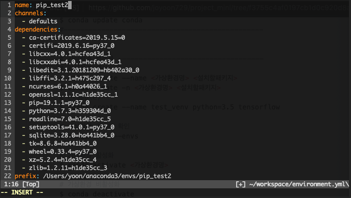

# Import conda dependencies

 

## Export Environment Configuration

save dependencies list into `environment.yml`

`conda env export > environment.yml`

 

## Edit prefix in `environment.yml`

edit **prefix** in environment.yml from source environment name to target environment name.

edit `name` and `prefix` to target environment name.

in this sample, edited target environment name is `pip_test2`, and path(prefix) is `/Users/yoon/anaconda3/envs/pip-test2`

 

## Update Environment From File

before run below command, you should ensure you are in working directory include `environment.yml`

`conda env update -f environment.yml`

 

## Or Create Environment From File

edit name&prefix to what you want to create environment name&prefix

`conda env create -f environment.yml`

 

## Reference

[https://pybit.es/guest-anaconda-workflow.html](https://pybit.es/guest-anaconda-workflow.html)

 

