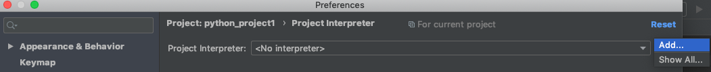
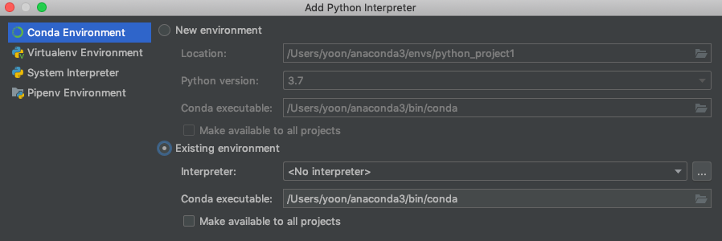
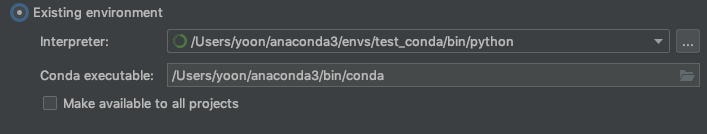

# Anaconda tutorial


아나콘다 기본 설치 및 사용법 기록


##  install

[https://www.anaconda.com/distribution/](https://www.anaconda.com/distribution/)

64-bit Command Line Installer 다운로드


파일 권한 변경

```bash
$ chmod 744 ~/Downloads/Anaconda3-2019.03-MacOSX-x86_64.sh
```

<br>

커맨드라인에서 실행

```bash
$ ~/downloads/Anaconda3-2019.03-MacOSX-x86_64.sh
```

<br>

enter 누르고 스크립트 하단으로 내려 동의.

Yes 입력

기다리면 된다.

<br>

설치확인

```bash
$ which python3
/Users/yoon/anaconda3/bin/python # 설치 완료
```


<br>

---

<br>

## basic usage

```bash
# 기본 명령어 -------------------------------------
# 기본 명령어는 conda 로 시작
$ conda <command> [option]

# 아나콘다 버전확인
$ conda --version

# 아나콘다 업데이트
$ conda update conda
#------------------------------------------------


# 가상환경 컨트롤 -----------------------------------
# 가상환경 생성
$ conda create --name <가상환경명> <설치할패키지>
$ conda create -n <가상환경명> <설치할패키지>
# example)
$ conda create --name test_venv python=3.5 tensorflow

# 가상환경 리스트 확인
$ conda info --envs

# 가상환경 활성화
$ conda activate <가상환경명>

# 가상환경 비활성화
$ conda deactivate

# 가상환경 삭제 삭제
# root/base 환경으로 활성화(activate) 후 삭제할 것
$ conda remove --name <가상환경명> --all
$ conda remove -n <가상환경명> --all
#------------------------------------------------


# 패키지 컨트롤 ------------------------------------
# 패키지 설치
$ conda install <패키지명>

# 패키지 리스트 확인
$ conda list

# 패키지 삭제
$ conda remove --name <가상환경명> <패키지명>
# 특정 가상환경을 활성화 했으면 --name <가상환경명> 생략가능
$ conda remove <패키지명>

# clean
# 인덱스 캐시, 잠긴 파일, 사용하지 않는 패키지, 소스 캐시 등 삭제
# 주의해서 사용할 것
conda clean --all
```

<br>

---

<br>

## Disable anaconda when start terminal

show auto_activate_base variable

```bash
conda config --show | grep auto_activate_base
```

set false

```bash
conda config --set auto_activate_base False
```

<br>

---

<br>

## PyCharm link with anaconda 

먼저 아나콘다 가상환경을 만들어둔다

PyCharm 실행

Preference -> Project Interpreter

<br>

click `Add…`



<br>

click `Existing environment` 

click `…`



<br>

add path `~/anaconda3/envs/<env_name>/bin/python_version`



<br>

이렇게 연결해두면, 터미널에서 `conda install` 로 패키지를 설치하던 PyCharm 에서 패키지를 설치하던 동일한 가상환경에 설치된다.

<br>

<br>