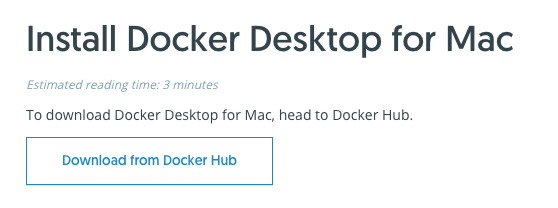
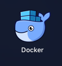
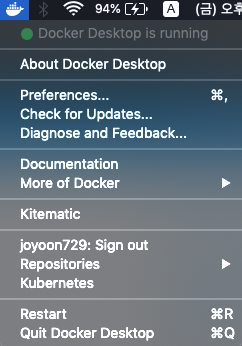

# Docker on Mac

OSX 에서 Docker 시작하기

쉽다. 아주.

 

## Install

[https://docs.docker.com/v17.12/docker-for-mac/install/](https://docs.docker.com/v17.12/docker-for-mac/install/#download-docker-for-mac)

 

## Run Docker Desktop

Docker Desktop 을 실행한다.

 

## Ensure Docker Desktop Running...

Docker Desktop 이 `Running` 상태가 될때가지 기다린다.

이제 터미널에서도 docker 명령어 실행이 가능하다. 끝.