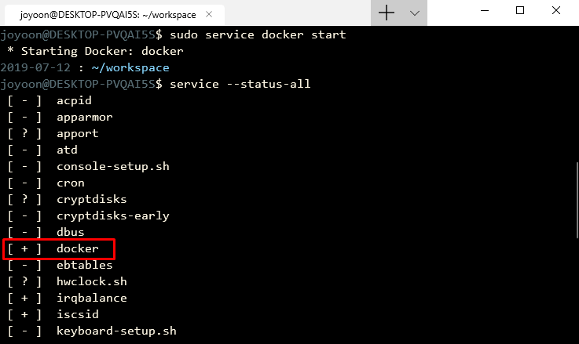

# Docker on WSL 2

Windows 10 에서 WSL 2(Windows Subsystem for Linux 2) 를 사용해 native Docker 사용하기

WSL 2 환경 구성법은 [switch_to_WSL2](https://github.com/joyoon729/project_mini/blob/master/Windows_Terminal/switch_to_WSL2.md) 참고.

<br>

## Install

```bash
$ curl https://releases.rancher.com/install-docker/17.03.sh | bash
```

```bash
$ sudo usermod -aG docker $USER
```

```bash
$ sudo apt-mark hold docker-ce
```

<br>

## Start native Docker daemon

Docker daemon 실행하기

```bash
$ sudo service docker start
```

Docker daemon 실행중인지 확인하기

```bash
$ service --status-all
```



<br>

## Ensure Docker is installed

```bash
$ docker version
```


Client 와, Server 정보가 정상적으로 출력되었다면 잘 설치된것.

<br>

## Reference

[https://medium.com/rkttu/wsl에서-native-docker-실행하기-ff75b1627a87](https://medium.com/rkttu/wsl에서-native-docker-실행하기-ff75b1627a87)