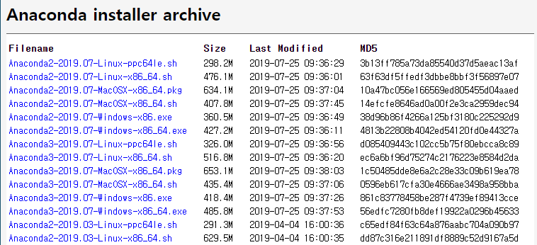

# Anaconda install on WSL

<br>

 `WSL`에 아나콘다 설치하기

<br>


## 1. 설치 파일 다운로드

[https://repo.continuum.io/archive/](https://repo.continuum.io/archive/) 에서 최신버전의 Anaconda3 를 다운받습니다.

`Anaconda3-[최근 날짜]-Linux-x86_64.sh` 를 다운받습니다.



`wget` 을 이용해도 됩니다.

```bash
$ wget https://repo.continuum.io/archive/Anaconda3-2019.07-Linux-x86_64.sh
```

<br>

<br>

## 2. 설치

아래 명령어로 다운받은 설치파일을 실행해 설치합니다.

```bash
$ bash Anaconda3-2019.07-Linux-x86_64.sh
```


### 2-1. 설치 경로 설정 (중요)

약관 동의를 위해 `Enter` 를 누르고, `yes` 를 입력하도록 합니다.

**이후 설치 경로를 설정하는 문구가 나오는데,** `Enter` 입력시 기본 경로인 `/mnt/c/Users/<username>/ananconda3` 에 설치되게 됩니다.

하지만 WSL 에서 정상 작동하기 위해 WSL의 linux 파일시스템의 home 디렉토리에 anaconda3를 설치하도록 합니다.

```bash
# 설치경로 변경해야함
[/mnt/c/Users/joyoon/anaconda3] >>> /home/joyoon/anaconda3  # 이걸로 입력
```


### 2-2. conda init 파일 생성 및 .bashrc 로 복사

설치 막바지에 **"conda init"** 을 해당 installer 로 생성할 지 묻는데, `yes` 입력하도록 합니다.

그러면 `/mnt/c/Users/<username>/` 경로에 `.bashrc` 가 생성되는데, bash 실행 시 conda init 에 필요한 코드가 generating 되어 있습니다.

하지만 이 경로는 WSL bash shell 이 인식하는 경로가 아니므로, 진짜 `.bashrc` 가 있는 `/home/<username>/.bashrc` 로 복사해 덧붙여줍니다.

```bash
# cat a > b   : a 내용을 b에 overwrite
# cat a >> b  : a 내용을 b에 append
$ cat /mnt/c/Users/joyoon/.bashrc >> /home/joyoon/.bashrc
```

이후 source 실행하거나 터미널 다시 실행하면 anaconda (base) 환경이 활성화됩니다.

```bash
$ source /home/joyoon/.bashrc
```

<br>

<br>

## 3. (base) 자동 활성화 방지하기

anaconda3 설치 후 터미널 실행할때마다 base environment 로 자동 activate 되는데, 이를 막고 싶다면,

```bash
$ conda config --set auto_activate_base false
```

명령어를 입력합니다.

<br>

<br>

