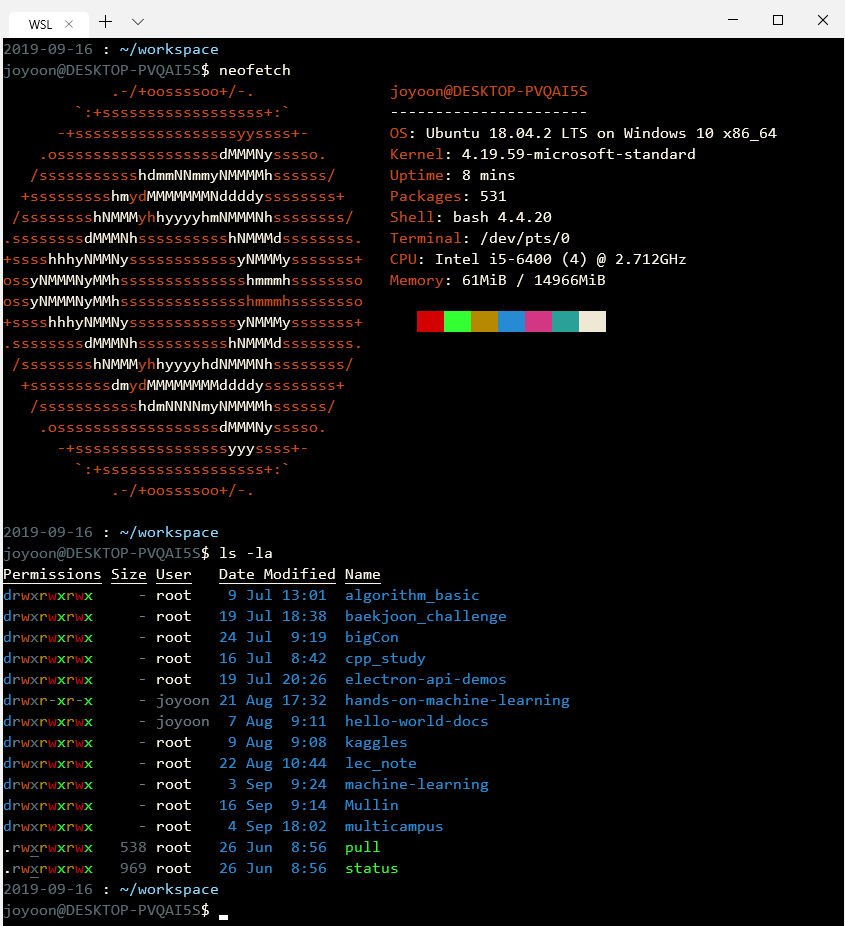

# new Windows Terminal

## Description

new Windows Terminal 을 더 잘 다루기 위한 프로젝트

  

## Contents

### profiles.json

- Settings file

### WSL.md

- install WSL
- import WSL to Windows Terminal
- initial bash settings

### my_prompt

- my PS1 variable format

### exa.md

- a tool to replace 'ls' command

### WSL_chmod.md

- git credential problem - trouble shooting

### explorer.md

- make a command to run Windows file explorer

### git-status

- automate `git status` command for all git directory

### git-pull

- automate `git pull` command for all git directory

### images/

- include images