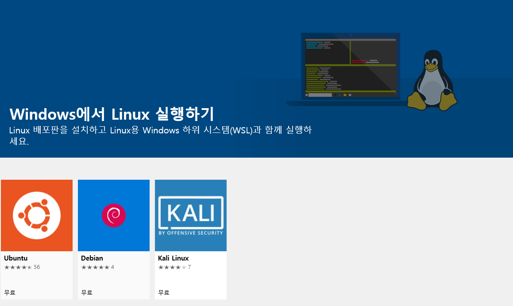

# WSL (Windows Subsystem Linux)

## 목표

1. WSL 설치하기
2. Windows Terminal 에 WSL import 하기
3. Windows Terminal 에서 잘 사용하기 위한 초기 bash 쉘 세팅


## 1. WSL 설치

**Linux용 Windows 하위 시스템** 기능 켜기


**Ubuntu 설치**

Windows Store 

--> WSL 

--> Ubuntu download/install




**초기 id / password 입력**

**완료**


---


## 2. Windows Terminal 에 WSL import 하기

**profiles.json 수정**

`wsl guid` 확인

```json
"guid" : "{78e390db-1bff-4533-9d7c-20f53d8bafa1}" #--> WSL guid
```


`"defaultProfile"` 을 `wsl guid` 로 변경

windows terminal 시작시 default 창을 결정

```json
"defaultProfile" : "{78e390db-1bff-4533-9d7c-20f53d8bafa1}"
```

> Note. 자세한 내용은 `profiles.json` 확인


---


## 3. Windows Terminal 에서 잘 사용하기 위한 초기 bash 쉘 세팅

WSL 은 가상화된 Linux 로 Windows 파일 시스템은 `/mnt` 에 마운트돼 있다.

> git 명령어와 같은 간단한 작업은 Windows 파일 시스템 안에서 사용해도 되지만 그 외의 작업은 Windows 파일 시스템 안에서 동작하는 것은 위험하다.

## .bashrc 수정

`/mnt` 이하 경로로 매번 가는 것이 귀찮기 때문에 정해둔 초기 디렉토리로 이동한다

`vi ~/.bashrc` 로 **.bashrc 를 열어 수정한다**


`WS` (workspace path) 변수 추가

``` bash
export WS=/mnt/c/Users/__windows_username__/workspace
```


bash shell 을 열때마다 `cd $WS ` 명령어 실행

```bash
cd $WS
```


`$HOME` 변수를 윈도우 파일시스템 기준으로 변경
`~` (tilde) 키워드를 윈도우 파일시스템에 맞게 사용할 수 있게함

```bash
export HOME=/mnt/c/Users/__windows_username__
```

