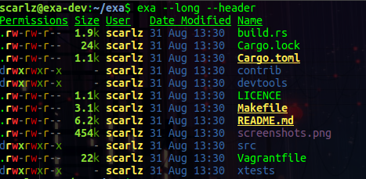
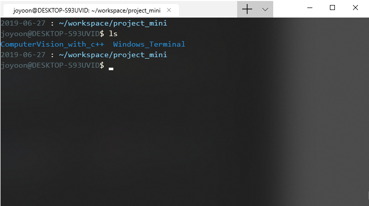
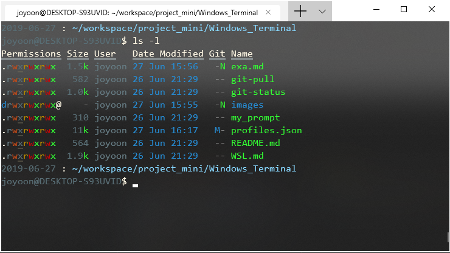
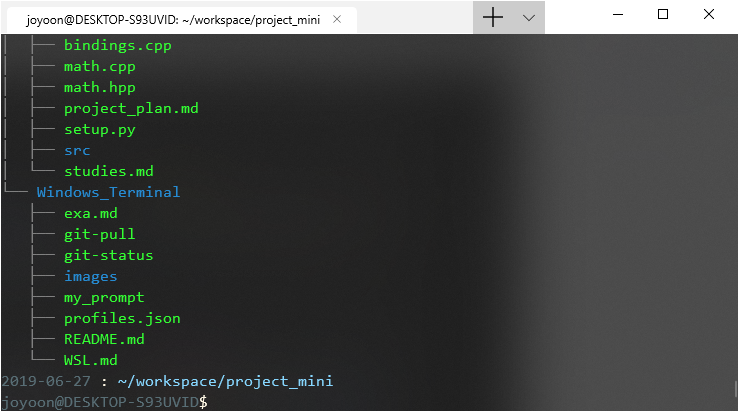

# exa package


'ls' 명령어를 대체할 수 있는 exa 패키지 설치 및 적용하기


## Features

- 파일별 highlight 지원
- 헤더 추가
- git status 확인
- tree view


## Install

<https://www.tricksofthetrades.net/2018/08/30/exa-getting-started/>


``` bash
$ wget https://github.com/ogham/exa/releases/download/v0.8.0/exa-linux-x86_64-0.8.0.zip
```

```bash
$ sudo apt-get install unzip
```

```bash
$ unzip exa-linux-x86_64-0.8.0.zip
```

```bash
$ sudo mv exa-linux-x86_64 /usr/local/bin/exa
```

```bash
$ rm exa-linux-x86_64-0.8.0.zip
```

**설치완료**

```bash
$ exa --long --header
```




---


## ls 명령어로 치환하기

alias 명령어로는 인자를 전달하지 못하므로 function 을 사용해 구현했다


`.bashrc 수정`

```bash
# apply 'exa' command
# ls alias
ls(){
	if [ "$1" = "-l" ]; then
		exa --git --header --long $2 $3 $4 $5
	elif [ "$1" = "-t" ]; then
		exa --tree --level=$2 $3 $4 $5
	else
		exa $1 $2 $3 $4 $5
	fi
}
```

`example`

```bash
$ ls -l # --> exa --git --header --long
$ ls -t 2 # --> exa --tree --level=2
```


## Usage

```bash
$ ls
```




```bash
$ ls -l
```



**Git header (git status)**

- `-N` : **Unstaged** new file
- `-M` : **Unstaged** modified file
- `N-` : **Staged** new file
- `M-` : **Staged** modified file


```bash
$ ls -t 2
```



**level 2 Tree View**
