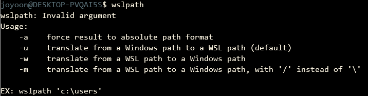

# explorer alias

<br>

## Description

In Mac OS, `open` command runs **Finder** application in terminal.

In this document, I wrote 'How to make `open` command equivalent of Mac OS's.'

<br>

## How to make?

edit `.bashrc`.

use bash shell function. not use `alias`.

append below code in `.bashrc`.

```bash
# explorer.exe alias function
open(){
	explorer.exe `wslpath -w "$PWD/$1"`
}
```

And source `.bashrc`.

```bash
$ source /home/$USER/.bashrc
```

### Why use shell function, not alias?

The argument of `open` command will located inside command sentence, not located end of sentence.

so we couldn't use alias.

```bash
# alias open='explorer.exe `wslpath -w "$PWD/"`'
$ open __target_directory_path__
--> explorer.exe `wslpath -w "$PWD"` __target_directory_path__
```

it will not working.


<br>

## explorer.exe

`explorer` is a Windows command equivalent of `open` command of Mac OS.

This command runs **Windows File Explorer **like `open` command.

### usage in Windows

```bash
$ explorer path
```

### problem

However, this command based on Windows file path.

so it doesn't work well in WSL(Windows Subsystem Linux).

### troubleshooting

I use **`wslpath`** WSL's command.

`wslpath` returns translated file path between WSL and Windows.

**usage**




As a result, we can use explorer command in WSL using `wslpath` translating.

<br>

## usage

```bash
$ open [filepath]
```


```bash
# current directory : project_mini/
$ open .
```


<br><br>


```bash
# current directory : project_mini/
$ open Windows_Terminal
```


