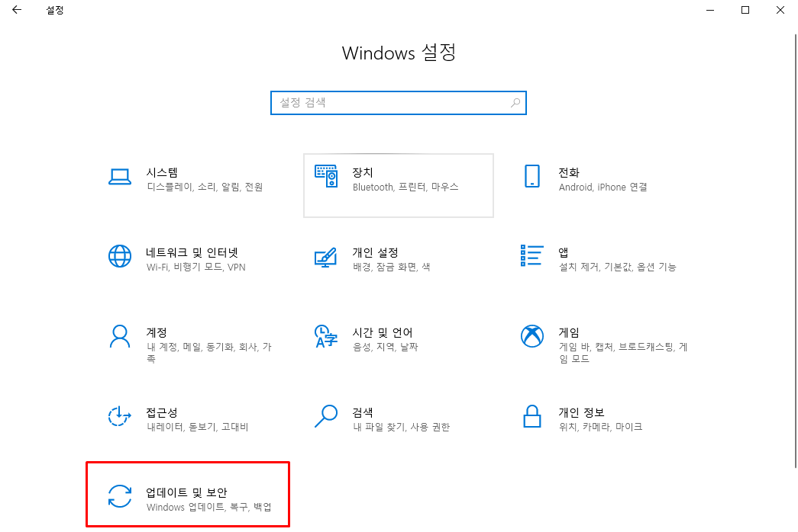
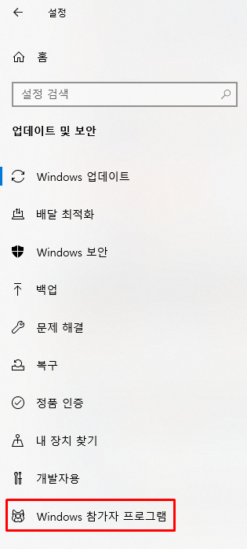
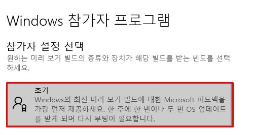
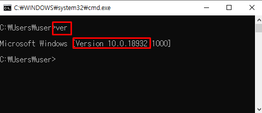
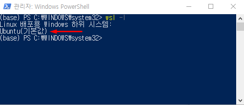
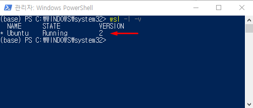

# switch to WSL2

<br>

## Intro

**How to switch from WSL1 to WSL2**.

Because of **Docker** issue in WSL1, I decided to switch from WSL1 to WSL2.

WSL2 supports **Docker**.

Let me introduce way to switch WSL2.

<br>

## Windows Insider Program

WSL2 is not stable version, so we can run WSL2 after Windows Build 18917.

to download Build 18917, we have to apply **Windows Insider Program**.

### How to apply Insider program?

in Windows settings, click update & security



<br>

in left blade, click Windows Insider Program



<br>

select Insider settings to **Fast('초기')**

and keep progressing the applying



<br>

in the end, Windows 10 will download&install latest OS build, restart your computer.

<br>

## Switching From WSL1 To WSL2

Let's start to switch!

### ensure windows version

requirement: windows version > 18917



<br>

### enable virtual_machine_platform component

run PowerShell as Administrator

and run following command

```powershell
PS> Enable-WindowsOptionalFeature -Online -FeatureName VirtualMachinePlatform
```

<br>

### switch to WSL2

check installed WSL distro

```powershell
PS> wsl -l
```



<br>

convert to wsl2 from wsl1

```powershell
# wsl --set-version <Distro> 2
PS> wsl --set-version Ubuntu 2
```

<br>

finally, check wsl list

```powershell
PS> wsl -l -v
```



<br>

### start WSL2

```powershell
PS> wsl Ubuntu
```

<br>

## Reference

[https://www.lesstif.com/pages/viewpage.action?pageId=71401661](https://www.lesstif.com/pages/viewpage.action?pageId=71401661)

[https://itfix.tistory.com/156](https://itfix.tistory.com/156)

